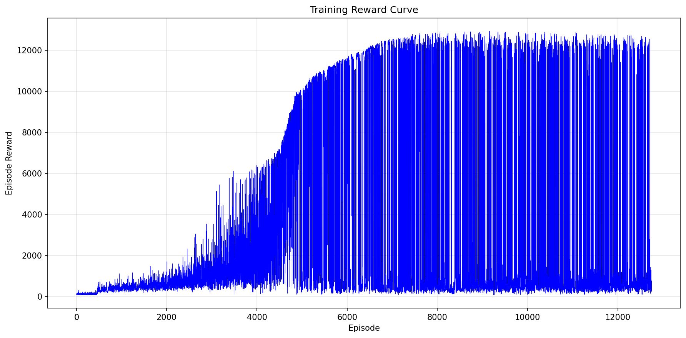

Humanoid-v4 TQC 训练工程

基于 Stable-Baselines3 + PyTorch 

环境要求
- Python 3.9
- gymnasium 0.29.1
- mujoco 2.3.7
- stable-baselines3 2.7.0
- sb3-contrib 2.7.0
- PyTorch 2.3.1+cu118

目标 ： 一分钟内跑得最远

工程结果：415米左右无跌倒的情况

训练奖励

参考视频：
<video controls src="eval_results/videos/episode_3_distance_416.07m.mp4" title="Title"></video>
